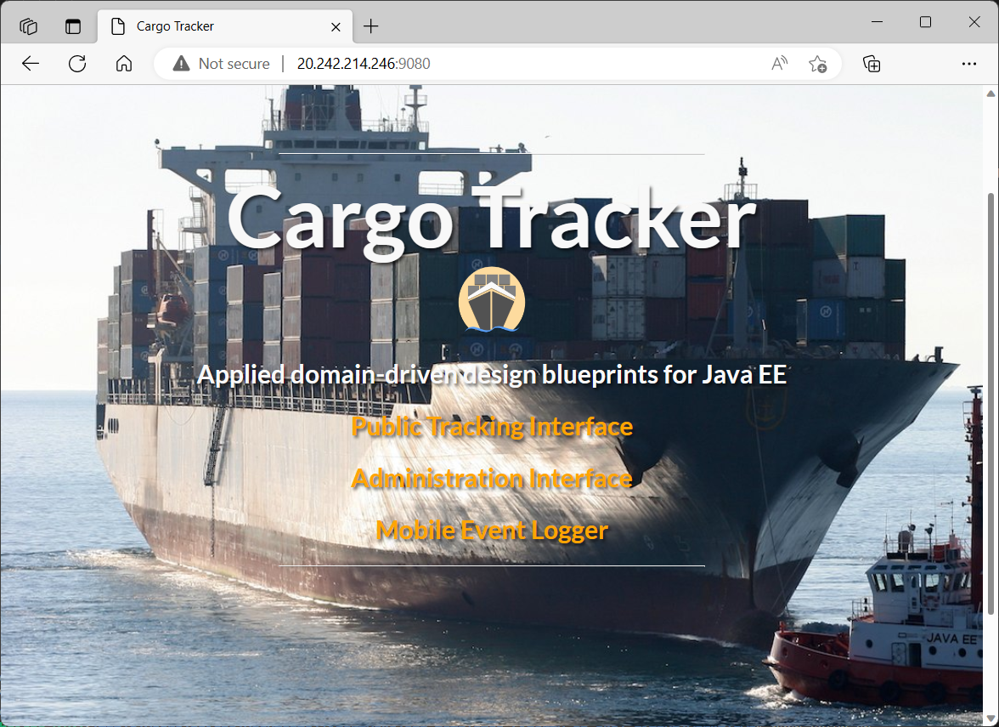

# Migrating Java (Open Liberty) Cargo Tracker Application to Azure Container Apps (ACA) using GitHub Copilot

## Scenario

### Client - Mission Statement: 
Allied Shipping mission is to provide accessible service to all residents and partners while delivering innovative global shipping and delivery solutions.
 
### Client - Migration Goals: 
- To Re-platform (Lift and Shift) a portfolio of 18 on-prem apps (16 Java and 2.NET), consisting of internal and external apps.

- Migrating to Azure Container Apps is an opportunity to optimize the Applications.

- Establishing an Azure Landing Zone (Hub ans Spoke Topolgy). Customer is looking for a secure cloud solution: i.e NVA, Firewall, VNet/Sunnetting...etc.
 
## Description

Allied wants us to conduct pilot to showcase how Copilot can help assist them in their applicaiton migration processes. This app is a Domain-Driven Design Jakarta EE application. The application is built with Maven and deployed to Open Liberty.  Currently (on prem), the application is exposed by Azure Load Balancer service via Public IP address; however, our goal will also showcase the app deployed to a secure Azure Landing Zone toplogy. 

Tech stack:

- Azure Container Registry
- Azure Container Apps
- Azure PostgreSQL DB
- GitHub Actions
- GitHub CoPilot for Azure
- Bicep
- Docker
- Maven
- Java

Let's jump in and get this up and running in Azure. When you are finished, you will have a fully functional web app deployed to the cloud.  

Screenshot of the deployed Cargo Tracker app

## Pre-requisites

1. Azure Subscription
2. GitHub Copilot enabled for repository
3. Azure SPN or Managed Identity with Federated Credentials setup for your repository:  

- az ad sp create-for-rbac --name cargotracker --role Contributor --scopes /subscriptions/your-subscription-name --sdk-auth

4. VSCode 
5. VSCode GitHub Copilot for Azure Extension

## Demo Steps

For this example, the infrastructure has been developed in Bicep and added to the repository already. I will be using some of the Commands listes below during the Demo. You can follow along Copilot prompts for assisting Applicaiton Migration. 

### Pre-Demo Tasks

1. Reveiw Application Infrastructure developed in Bicep.
2. Review Dockerfile

### Introduction

1. Open VSCode and install GitHub Copilot for Azure extension.
2. Login to Azure and GitHub in VSCode.
3. Open the GitHub Copilot chat window.
4. Use the following prompt: `@azure Tell me about my application`

### Application Assessment

ft and 1. Use the following prompt: `@azure What is the current Java Version for this application?`
2. Use the following prompt: `@azure What is the Applications Java Version Supported by Azure Container Apps?` 
3. Use the following prompt: `@azure Should I upgrade the Application’s Java Version before migrating to Azure Container Apps?`
4. Use the following prompt: `@azure What is the Application’s Build Type?`  
5. Use the following prompt: `@azure What is the Application’s Web Server Type?`  
6. Use the following prompt: `@azure What is the Application’s Web Server Version?`
7. Use the following prompt: `@azure What is the Application’s Runtime Version?`

### Java Components Assessment

- Open the Application POM.XML File

1. Use the following prompt: `@azure Is the Application WEB.XML File up to date?`
2. Use the following prompt: `@azure How can I update the Application WEB.XML File?`
3. Use the following prompt: `@azure Is the Application POM.XML File Dependency versions up to date?`
4. Use the following prompt: `@azure How can I update the Applications POM.XML File`

- Open the POM.XML FIle. Click the *Apply in Editor* button in Copilot and save the content in each respective file. 

5. Use the following prompt: `@azure What are the current Application Dependencies?`
6. Use the following prompt: `@azure Will the Application deploy as JAR, WAR or EAR File?`
7. Use the following prompt: `@azure How do I build the Application WAR File?`

### Azure Services 

#### ** The primary BICEP FIles are already loaded in e Infra Modules Folder, these are just extra Azure servies...**

1. Use the following prompt: `@azure Which Azure Services are best for hosting a scalable Azure Container App?`
2. Use the following prompt: `@azure What Azure services should I use with my Azure Container App?`
3. Use the following prompt: `@azure Add an Azure Key Vault?`
4. Use the following prompt: `@azure Add Log Analytics`
5. Use the following prompt: `@azure Add Azure Monitor`
6. Use the following prompt: `@azure Add an Azure App Insights`

- Click Generate to create Bicep files   

7. Use the following prompt: `@azure Add an Azure Container App Env to spoke_networking.Bicep File`
8. Use the following prompt: `@azure Add an Azure Container App to spoke_networking.Bicep File`
9. Use the following prompt: `@azure Add an Azure Container Registry to spoke_networking.Bicep File`

### Azure Infra

1. Use the following prompt: `@azure What is Azure Hub and Spoke Topology?`
2. Use the following prompt: `@azure What is Azure ACA Landing Zone Accelerator?`
3. Use the following prompt: `@azure Does the BICEP in the Modules Folder Deploy a Hub and Spkke Toplogy?`
4. Use the following prompt: `@azure What are the recommended CIDR ranges for ACA VNet and Subnet?`

### Containerization

- Open the Application Dpcker File. 

1. Use the following prompt: `@azure Check my Application’s Dockerfile?`
2. Use the following prompt: `@azure How can I optimize my Dockerfile for better performance?` (Split the Build into optimized Multi-Stage Build)

- Click the *Apply in Editor* button in Copilot and save the content in each respective file. 
- Manual Build Steps (optional; are listed in Activity One):

### Deployment (GitHub Actions)

- Open GITHUB Actions Deployment File, located in the Workflow FOlder:  deployJava_Cargo-Tracker_ACA-infa.yml

1. Use the following prompt: `@azure Help me write a GitHub Actions to deploy this application including a Bicep deployment.`
2. Use the following prompt: `@azure Use OIDC for Azure login.`
3. Use the following prompt: `@azure Can you add the bicep deployment to the github actions?`
4. Open the Workflow File. Click the *Apply in Editor* button in Copilot and save the content in the file. 

### Troubleshooting

1. Use the following prompt: `@azure Where can I find metrics and logs?`
2. Use the following prompt: `@azure Have my container app's system console logs contained any warnings recently?`

### Optimization

1. Use the following prompt: `@azure Are any app code optimizations available?`
2. Use the following prompt: `@azure Show me how to optimize CPU usage for Azure Container Apps.`
3. Use the following prompt: `@azure How do I optimize code for Azure Container Apps?`
3. Use the following prompt: `@azure What are the best practices for security in Azure?"`

### Cleanup

1. Use the following prompt: `@azure How do I undeploy my project with the Azure Developer CLI?`

### Edits

After using Copilot to generate the structure and some of the functionality for each of these components, edits had to be made to support a successful deployment including:

- Updating dependencies in the POM.XML File.
- Reviewing and Updating he Web.Config File.
- Updating the Enviorment Variables in the deployJava_Cargo-Tracker_ACA-infra.yml File. 
- Adding the Secret Variables to the GITHUB repo. (i.e. Azure_Credentials, Azure_Subscription...etc.)
- Add Docker Login to GitHub Actions
- Add Container App Environment to Spoke_Networking.BICEP File
- Add Container App to Spoke_Networking.BICEP File
- Add Container Registry to Spoke_Networking.BICEP File
 

## Activities

### Activity One: Application Build

Let's try to generate the Application War File automatically via the Dockerfile.

We will be adding in the following command to the Dockerfile Build Stage to build the application and package it with dependencies:

- RUN mvn clean package -DskipTests

Sample Commands:

`@azure Check my Application’s Dockerfile?`

`@azure How can I optimize my Dockerfile for better performance?` (Split the Build into optimized Multi-Stage Build)

Now, let's try to generate the Application War File Manually.  If you haven't already, you will need to install and configure several tools for our development environment:

- [Java 8 Java Development Kit (JDK)](https://www.oracle.com/java/technologies/javase/javase8-archive-downloads.html)
- [Apache Maven build and configuration tool](https://www.baeldung.com/install-maven-on-windows-linux-mac)
- [Extra Information, if you need more infotmation](https://www.twilio.com/en-us/blog/install-java-8-apache-maven-google-web-toolkit-windows-10-html)

Steps to Build the WAR File:

1. Navigate to the Project Directory: Open a terminal and navigate to your project's root directory where the pom.xml file is located.

2. Run the Maven Package Command: Execute the following command to build the WAR file:

- mvn clean package

3. Locate the WAR File: After the build process completes, the WAR file will be located in the target directory. For example:

- target/cargo-tracker.war

Example Terminal Commands:

- cd /path/to/your/project
- mvn clean package

Upon successful completion of the mvn clean package command, your WAR file (cargo-tracker.war) will be available in the target directory of your project.

### Activity Two: Adding Azure Services to Specific BICEP Files

We showed how to use Copilot to generate BICEP Files for various Azure Servies and deploy them using GITHUB Actions. Using your knowledge and the information below try generating new adding in Azure Services by modifying existing BICEP Files. 

1. Goto the BICEP Files located in the "infra/IBMLiberty_Bicep/modules" Folder.

2. Select the "spoke_networking.bicep" file. 

3. Try the following commands to add an Azure Container Registry and an Azure Container App:

Sample Commands:

`@azure Add an Azure Container App Env to spoke_networking.Bicep File`

`@azure Add an Azure Container App to spoke_networking.Bicep File`

`@azure Add an Azure Container Registry to spoke_networking.Bicep File`

### Activity Three: Application Dependencies and GitHub Actions 

Let's try to use Copilot check and upgrade our POM.XML File.  Then let's try to generate the GitHub Actions workflow ourselves. We showed some basic steps in the demo, but we had to make a few edits to the workflow and additional commands to make it work. Given the following information, try to use your knowledge and Copilot to generate the GitHub Actions workflow.

1. We have IaC we need to deploy that's written in Bicep. (the BICEP Files are located in the "infra/IBMLiberty_Bicep/modules")

2. Open GITHUB Actions Deployment File, located in the Workflow FOlder:  deployJava_Cargo-Tracker_ACA-infa.yml

3. Try the following commands to create a sample GITHUB Action BICEP Deployment File: (compare the Copilot of Azure version to the current version, review the changes)

Sample Commands:
`@azure Is the Application POM.XML File Dependency versions up to date?`

`@azure How can I update the Applications POM.XML File`

`@azure Help me write a GitHub Actions to deploy this application including a Bicep deployment.`

`@azure Use OIDC for Azure login.`

`@azure Can you add the bicep deployment to the github actions?`

 Click the *Apply in Editor* button in Copilot and save the content in the file. 
